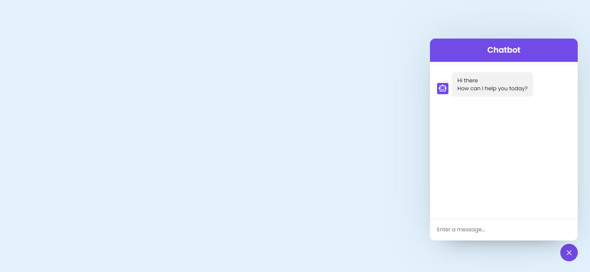
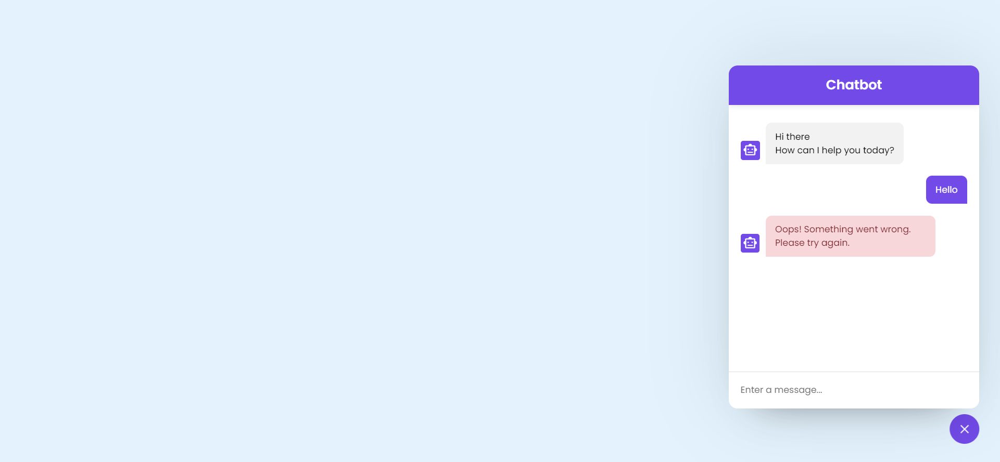

# 🤖 AI Chatbot

This project showcases an interactive AI chatbot that utilizes the OpenAI API to provide responses based on user input. The chatbot features a clean and user-friendly interface, making it easy to communicate and receive assistance.

## 🌈 Project Overview

The AI chatbot is designed to enhance user interaction through a responsive chat interface. It supports sending messages and displays AI-generated responses in real time.

### 🔗 Live Demo
[View Live Demo](https://omkar-hundre.github.io/ChatbotFrontEnd/)

## 📁 Getting Started

To set up this project locally, follow these steps:

1. Clone the repository or download the ZIP file.
2. Open the `index.html` file in your web browser.
3. Replace `Your_API_key` in the JavaScript file with your actual OpenAI API key.

## 💻 Technologies Used

- **HTML5**
- **CSS3**
- **JavaScript**
- **OpenAI API** for AI functionalities

## 📸 Screenshots

  
  
  

## 📝 Features

- Responsive design for both desktop and mobile
- Seamless chat interface with smooth transitions
- AI-powered responses using OpenAI API
- User-friendly message input and display

## 🙏 Acknowledgements

A special thanks to **Shraddha Didi** for teaching me HTML, CSS, and JavaScript!

## 🔗 Connect with Me

- **GitHub:** [https://github.com/Omkar-Hundre](https://github.com/Omkar-Hundre)
- **LinkedIn:** [https://www.linkedin.com/in/hundreomkar/](https://www.linkedin.com/in/hundreomkar/)

Feel free to explore the project and provide feedback! Your contributions are welcome!
